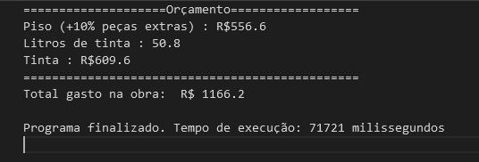

# construction-budget
Short program to calculate a basic construction budget.

## Exercise:
### Crie um programa no [portugol studio](https://portugol-webstudio.dgadelha.xyz/ide) responsável por auxiliar um engenheiro nas contas de uma obra. Ele deve seguir as seguintes instruções:
* Perguntar para o usuário seu nome. Leia o nome digitado e personalize as próximas mensagens com o nome digitado.
  - Exemplo de mensagem exibida: Henrique, seja bem-vindo ao sistema de obras. Para melhor auxiliá-lo, precisaremos das seguintes informações:
* Pergunte e leia quantas janelas e portas existem no projeto.
* Pergunte e leia o tamanho total das paredes existentes no projeto (m²).
* Perguntei e leia o preço do litro da tinta que será utilizada para pintar as paredes.
* Pergunte e leia o tamanho da área em m² que será colocado o piso.
* Pergunte e leia o preço do m² do piso.
* Pergunte se o usuário quer ou não adicionar uma piscina ao projeto (utilize caracter com S/N para a resposta).
* Ao final, após coletar as informações, o programa deve gerar o seguinte resultado:
  * Informar o total gasto com o piso.
  * Informar quantos litros de tinta foram utilizados e o total gasto com a tinta.
  * Informar o total gasto com piscina.
  * Além disso, deve ser informado ao usuário o total que será gasto com essa obra.
### Observações Gerais:
* As portas possuirão por padrão um tamanho de 2.1m².
* As janelas possuirão por padrão um tamanho de 1,5m².
* O espaço ocupado pelas portas e janelas não poderá ser maior do que o tamanho total das paredes.
  * Caso as portas e janelas ocupem um tamanho maior do que o tamanho total das paredes, informe ao usuário que isso não pode acontecer.
* Somente a parede será pintada. As portas e janelas não devem ser contabilizadas na hora da pintura.
* 1 litro de tinta pinta 1 m².
* Para facilitar o processo, ignore a existência de rodapés.
* Para facilitar o processo, ignore a existência de rejunte ou outros espaçamentos no piso.
* Ao calcular o custo total que será gasto com o piso, adicione 10%.
  * Esse aumento será para a compra de peças extras que poderão ser utilizadas em caso de danos às peças originais.
* Ao verificar se o usuário quer ou não uma piscina, tanto o ‘S’ quanto o ‘s’ devem ser aceitos como uma resposta válida.
* Caso o usuário queira uma piscina, adicione R$ 25.000,00 ao custo total da obra.
* No sistema deve ser ignorado o valor que poderia ser gasto com funcionários, levando somente em consideração as informações passadas neste documento.
* Não devem ser utilizadas: estruturas de repetições nem funções para a resolução.
